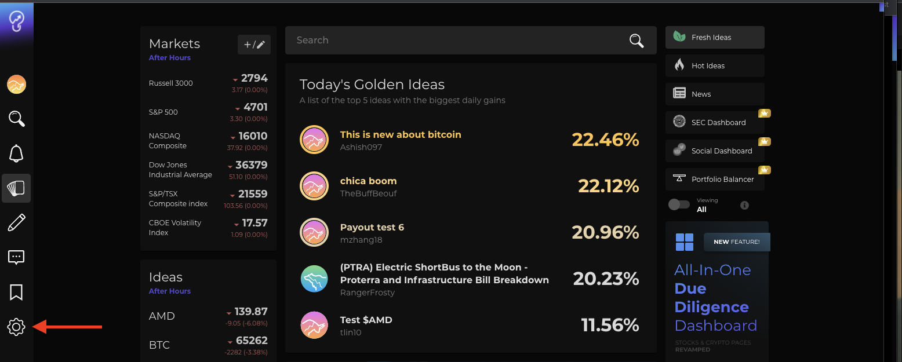

# 🗺 Quickstart Guide

## Get your API keys

Your API requests are authenticated using API keys. Any request that doesn't include an API key will return an error.

### **To obtain your API Key, you must:**


Must be a member of Utradea.



Must obtain your apiKey by following the GET API Key steps.



**Have trouble obtaining an enterprise token**?

Email us at: support@utradea.com


## **Rate Limit Guidelines**


All members are subject to request rate limits based on their Utradea membership tier.

Repeated abuse of the API rate limit is subject to further review by the Utradea team, and can result in IP address blockage or revocation of enterprise rights.


| Utradea Membership Tier | Rate Limit                    |
| ----------------------- | ----------------------------- |
| Standard                | 5  Requests per 15 minutes    |
| Premium                 | 150 Requests per 15 minutes   |
| Enterprise              | 1000 Requests per 15 minutes  |

## Language Support


Our get started guides are written with sample requests & responses written in **Node.js** or **Python**. Please make sure you have the following pre-requisites installed.


| Language | Version                      |
| -------- | ---------------------------- |
| Node.js  | nodejs version 12 or higher  |
| Python   | python version 3.6 or higher |

## Authentication Steps

### Step 1 - Sign Up For Your Utradea Account (Free)

If you do not have an account with Utradea, go to [https://utradea.com/](https://utradea.com) and click '**Register**'.

### Step 2 - Click on the 'Settings' icon on Utradea feed page.

Once you have successfully registered, go to the bottom left corner and click on the 'Settings' icon, which redirects you to the 'Settings' page.

### **Step 3 - Click Generate API Key in 'API' Section**

On the Settings page, look for the 'API' section. Click '**Generate API Key**' to create an API secret key. A created timestamp record will display in the '**API**' section after your key is successfully generated.

To generate a new key, simply click '**Generate API Key'**. The previously generated key will be deleted, and a new created at timestamp record will display.

.png>)

To copy your key for usage, click on '**Copy**'.&#x20;

.png>)

#### **Now you are ready to make your first request!**
